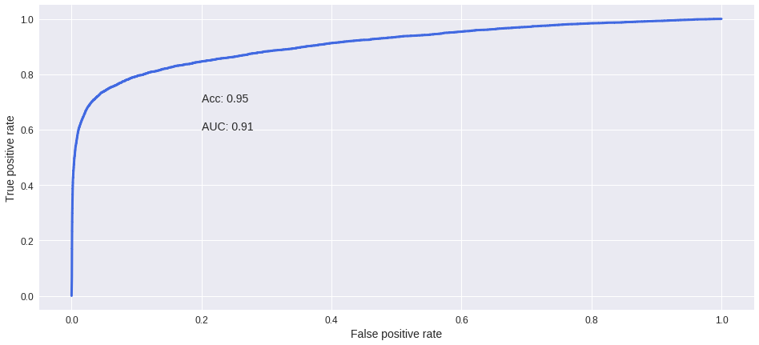
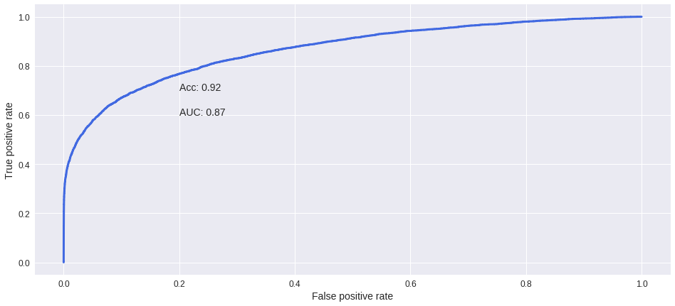
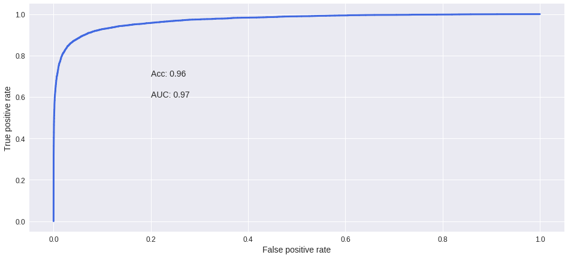
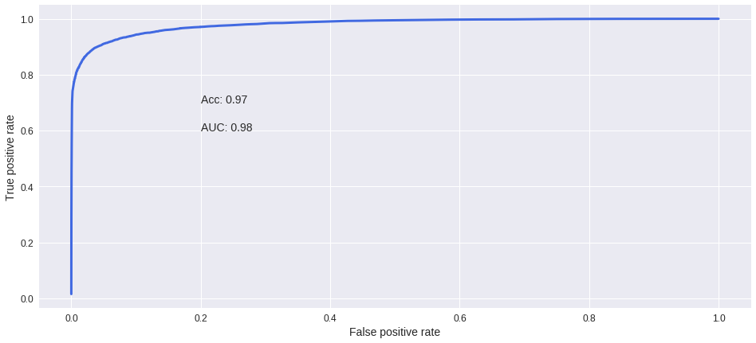

Toxic Comments Classification
==============================

Predicting toxic comments in Wikipedia's talk page edits.

Project Organization
------------

    ├── LICENSE
    ├── README.md
    ├── data
    │   ├── processed
    │   └── raw
    ├── notebooks
    ├── reports
    │   └── figures 
    └── src

--------
## Goal

The challenge is to build a multi-headed model capable of detecting different types of of toxicity in Wikipedia's comments, like threats, obscenity, insults, and identity-based hate. The dataset that will be used is comprised of comments from Wikipedia’s talk page edits. Improvements to the current Wikipedia's model could potencially help online discussion become more productive and respectful.

## Getting Data

The data can be freely downloaded from the [Kaggle competition page](https://www.kaggle.com/c/jigsaw-toxic-comment-classification-challenge/data) and consists of only three final tables, so there will be little to do here in the sense of merging datasets and understanding table relations:

* train.csv
* test.csv
* sample_submission.csv

The datasets needed only a quick preparation and word factorization before testing the NLP models. 

## NLP Models accuracy

#### Naive Bayes Classifier

#### Bag-of-words features with TF-IDF algorithm

#### Bag-of-words features with an optimized TF-IDF algorithm

The previous TF-IDF Vectorizer model was optimized with parameters 'max_features': None, 'min_df': 1 and the multinomial Naive Bayes model with 'nb_alpha': 0.01, giving the next results:

#### Word2Vec model

This was the model used for final predictions, as it offered the best accuracy results:

